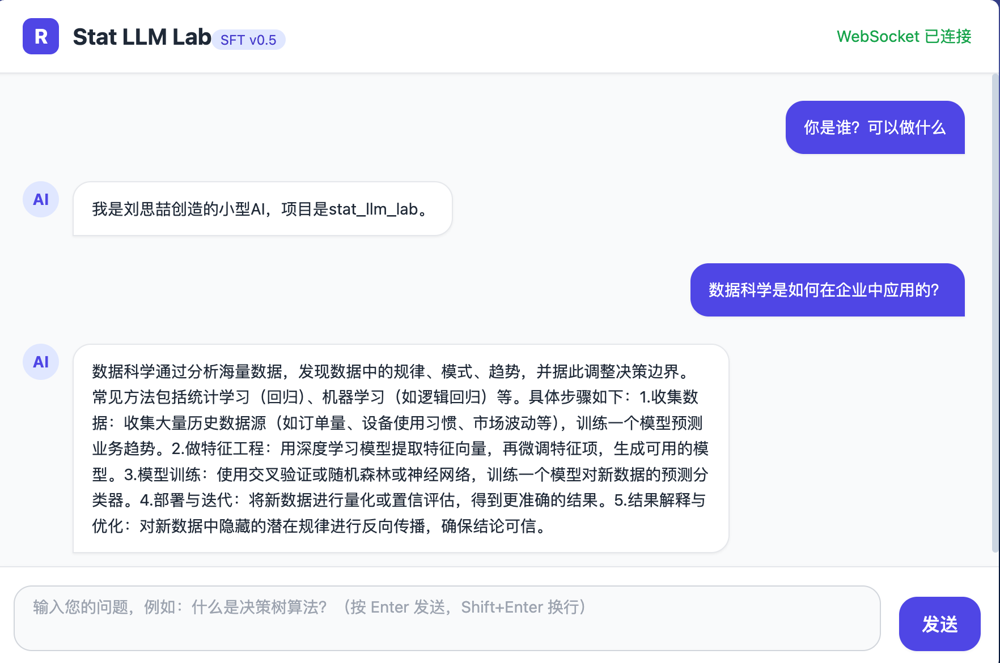
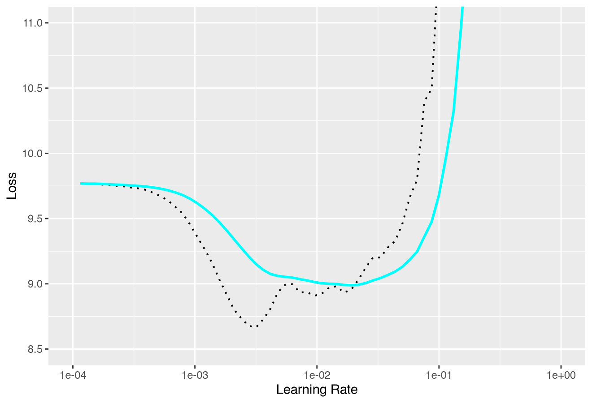
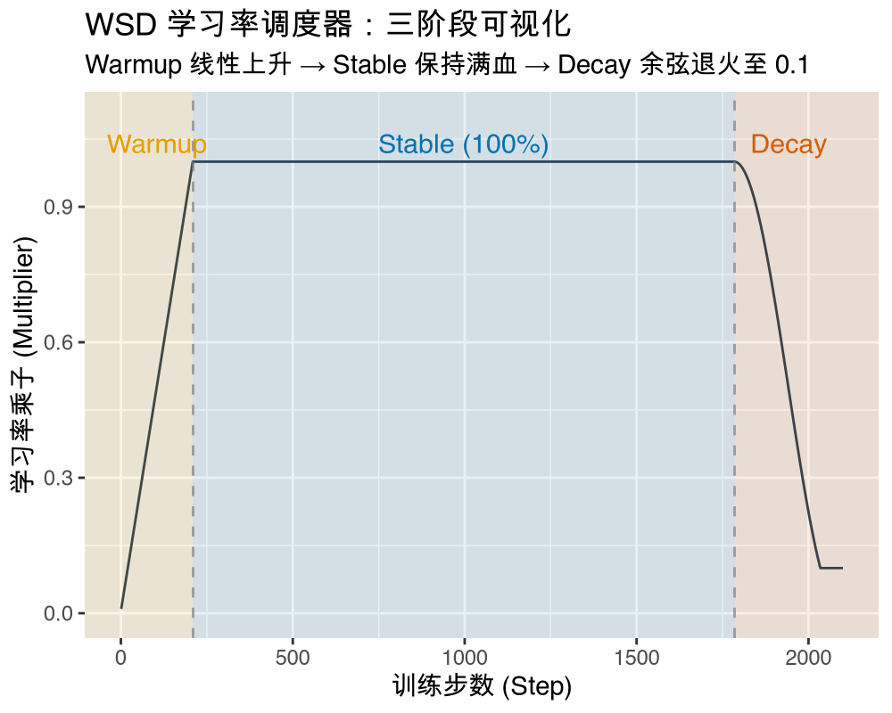
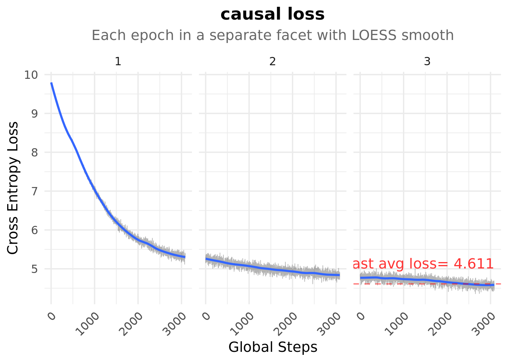
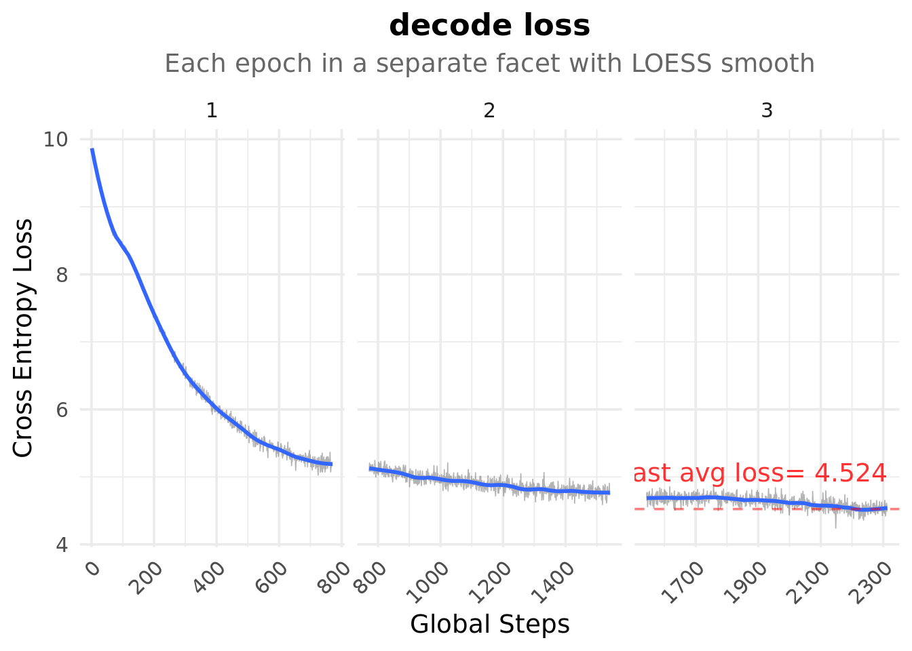
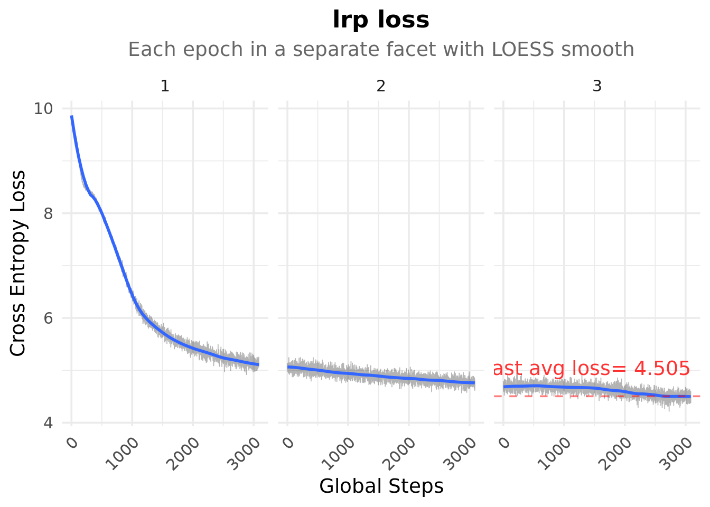
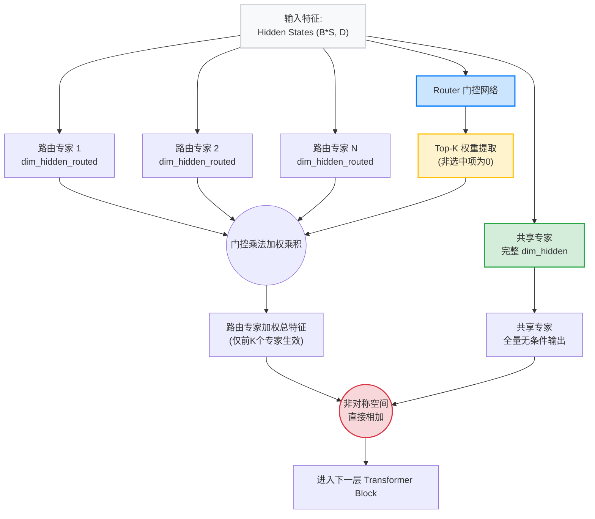
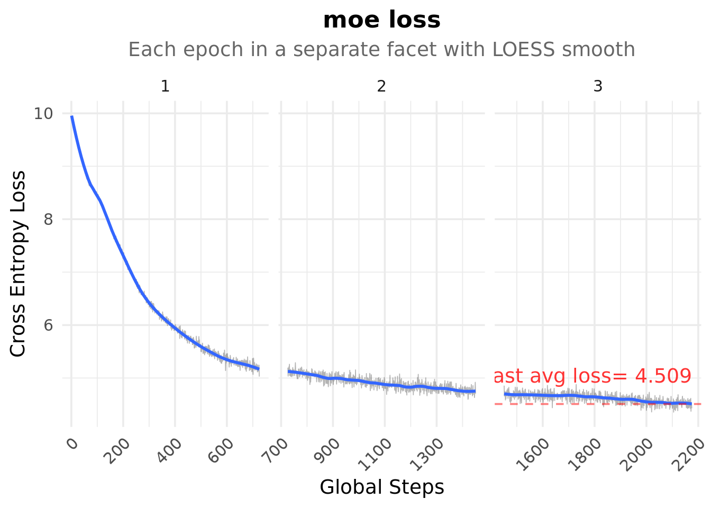
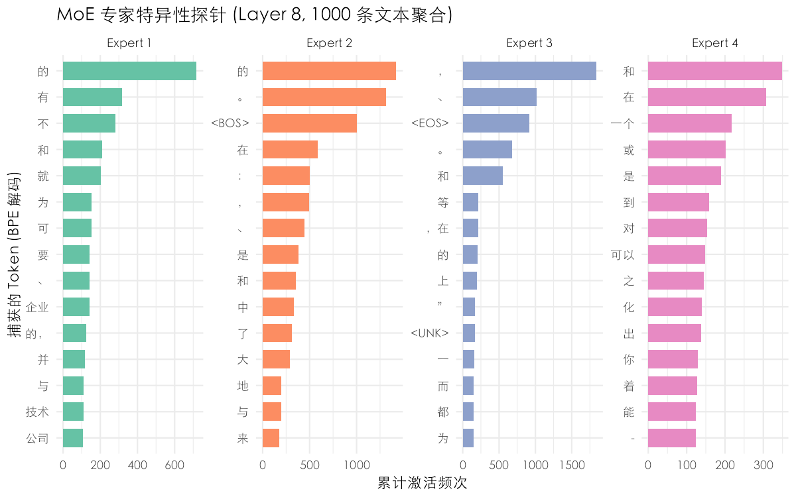
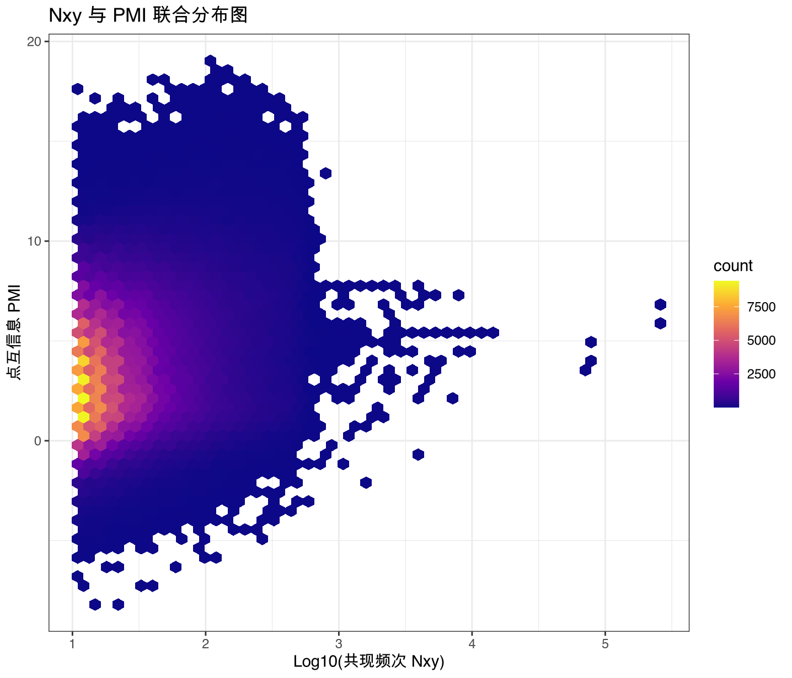

# 大模型的统计实验室


本项目使用 R 语言的 `torch` + `luz` 深度学习框架，实现了多种 LLM（大语言模型）架构，涵盖从经典因果语言模型到实验性的 JEPA、对比学习、MoE 模型训练等前沿方法，以及 UI 部署、大模型的评测、统计水印（Deepfake 披露）等技术。

读者有兴趣可以访问在线 Demo（潜在空间残差预测）：<http://110.40.168.251:8080>

<div align="center">

</div>

---

2026 年 5 月，与好友 [Vivian Zhang](https://nycdatascience.com/team-member/vivian-zhang/)（NYC Data Science Academy 创始人）聊到 Yann LeCun 团队在 JEPA 方向的工作，深受启发。JEPA 那套"预测抽象特征空间而非具体像素"的理念，让我想到：如果在语言建模中也放弃直接的 token 级预测，转而在连续语义空间中做预测，会是什么效果？

顺着这个思路，陆续探讨了从经典 GPT 到对比学习、残差预测，JEPA 世界模型、MoE 模型等多种架构。以及归一化对数似然的四选一模型评估、表征工程、logit 透镜等分析技术。
当然还有一个更为关键问题：如何从各类 LLM 项目中找到合理的语料数据，并能够在 1-2 个小时训练出结果。

该项目以 R 语言的 `torch` + `luz` 实现，这一组合在 LLM 领域虽不常见，却也恰好验证了这些想法与框架无关。

---

## 目录

- [大模型的统计实验室](#大模型的统计实验室)
  - [目录](#目录)
  - [一、统一设计的模块](#一统一设计的模块)
  - [二、各类 LLM 架构](#二各类-llm-架构)
    - [1. 经典交叉熵架构 — `causal_lm`](#1-经典交叉熵架构--causal_lm)
    - [2. 经典交叉熵架构（工业加速版）— `decode_only`](#2-经典交叉熵架构工业加速版-decode_only)
    - [3. 潜在空间残差预测 — `latent_residual`](#3-潜在空间残差预测--latent_residual)
    - [4. 潜在空间对比学习 — `latent_contrastive`](#4-潜在空间对比学习--latent_contrastive)
    - [5. JEPA 完整实现（世界模型）— `world_model`](#5-jepa-完整实现世界模型-world_model)
    - [几种方法对比总结](#几种方法对比总结)
  - [三、MoE 模型训练](#三moe-模型训练)
    - [1. 模型架构（DeepSeek-MoE 风格）](#1-模型架构deepseek-moe-风格)
    - [2. 负载均衡辅助损失](#2-负载均衡辅助损失)
  - [四、数据、训练和 Web UI 推理服务](#四数据训练和-web-ui-推理服务)
    - [数据来源和清洗](#数据来源和清洗)
    - [完整的训练流程](#完整的训练流程)
    - [Web 服务架构](#web-服务架构)
  - [五、评估策略和拆解 LLM](#五评估策略和拆解-llm)
    - [1. 整体评估](#1-整体评估)
    - [2. 表征工程 (RepE)](#2-表征工程-repe)
    - [3. Logit 透镜](#3-logit-透镜)
  - [六、统计水印](#六统计水印)
  - [七、项目结构和环境要求](#七项目结构和环境要求)
    - [项目结构](#项目结构)
    - [环境要求](#环境要求)
  - [License](#license)


---

## 一、统一设计的模块

所有架构共享以下基础设施：

- 数据处理：放弃逐行文本读取，直接将语料预编码为二进制流（`.bin`），训练时通过指针偏移量零拷贝读取 Token。
- 模型组件：RMSNorm（均方根归一化）、RoPE（旋转位置编码）、SwiGLU 前馈网络、FlashAttention（`torch_scaled_dot_product_attention`）。
- 训练策略：分组优化器（不同参数组使用不同学习率）、WSD（Warmup-Stable-Decay）学习率调度、梯度裁剪（max_norm=1.0）、AMP 自动混合精度。
- 推理策略：自回归解码 + 滑动窗口上下文，支持温度缩放、重复惩罚、Top-K 采样。

统一默认超参：词表大小 16384 | 隐层维度 320 | 层数 8 | 注意力头数 8 | 序列长度 512。总参数大小 15M 左右，约为 deepseek-V3(671B) 的 $1/45000$。是个小脑袋，所以不要苛求比肩 deepseek 的智能推理结果。

为了让模型有一定智能，数据经过严格的挑选和处理，具体步骤可以参考第四节。实际预训练语料采用标准 JSONL 格式，0.5G 大小，46 万行，经过 BPE 分词后约 110M token。按照 Chinchilla 定律，15M 参数规模的模型应该为之配备 300M token 数据才能获得较好的训练效果，因此每个架构都重复训练了 3 个 epoch。

在 NVIDIA 3090 24G 服务器上，约 17 分钟一个 epoch，加之微调和 BPE 分词两个环节，约 1 小时即可完整复现 LLM。

通过 LR finder 找到最佳学习率为 `2e-3`：

<div align="center">

</div>

WSD（Warmup-Stable-Decay）学习率调度变化曲线：

<div align="center">

</div>

---

## 二、各类 LLM 架构

### 1. 经典交叉熵架构 — `causal_lm`

最基础的语言模型实现，等价于一个小型 GPT。使用 `luz` 高阶训练框架。

核心原理：Transformer 解码器输出隐状态 $H_t$，直接投影到词表空间计算 logits，通过 Softmax + 交叉熵损失学习"下一个词的概率分布"。

特点：

- 权重绑定（weight tying）：logits 通过 $H \cdot W_{emb}^\top$ 计算，无独立 LM head
- 两阶段预训练：Stage 1 使用 WSD 调度器，Stage 2 余弦退火
- SFT 微调支持 loss masking（仅对回复部分计算损失）

```
输入 Token → Transformer Blocks → H → 词表投影 → CrossEntropy(y)
```

<div align="center">

</div>

通过执行以下脚本获得：

```r
quarto preview loss.qmd -P file:xxx_loss_xxxx.csv
```

注意观察损失函数图的最后一段，Warmup-Stable-Decay 学习率调度器在 decay 阶段的效果很明显，将 loss 又降低了一截。

> **实验效果**：作为基准架构，15M 参数在 130M token 上训练 3 个 epoch 后，loss 稳定收敛，生成文本具备基本的语法连贯性和语义一致性。

---

### 2. 经典交叉熵架构（工业加速版）— `decode_only`

与 `causal_lm` 架构相同，但做了面向 GPU 训练的工业级优化，使用纯 `torch` 实现（不依赖 `luz`）。

相比 `causal_lm` 的改进：

| 特性 | causal_lm | decode_only |
|------|-----------|-------------|
| 训练框架 | luz 高阶 API | torch 原生循环 |
| Query 头共享 | Multi-Query Attention | Grouped-Query Attention |
| KV Cache | 不支持 | 支持 |
| 梯度累加 | 不支持 | 支持（ENV_GRAD_ACCUM=4） |
| AMP | luz 内置 | 手动 `cuda_amp_grad_scaler` + 梯度缩放 |

适用于更大规模的预训练场景，显存利用率更高，推理复杂度从 $O(N^2)$ 到 $O(N)$，速度更快。

Loss 的变化曲线如下所示：

<div align="center">

</div>

> **实验效果**：与 `causal_lm` 相比，在相同训练条件下 loss 曲线基本一致。得益于梯度累加的作用，使得更大 batch size 下的训练更稳定，最终 loss 更低。

---

### 3. 潜在空间残差预测 — `latent_residual`

核心思想：当前时刻的隐状态 $H_t$ 已经包含丰富信息，下一时刻的状态不应从零生成，而应是当前状态的自然顺延（残差连接）：

$$Pred_{t+1} = H_t + \Delta H_t$$

其中 $\Delta H_t$ 由一个 2 层 MLP 预测器（Predictor）从 $H_t$ 中学习，预测器最后一层权重初始化为零（zero-init），确保训练初期 $Pred \approx H$，起到恒等映射的 warm-up 效果。

训练与推理统一使用交叉熵损失：将 $Pred$ 投影回词表空间（通过 $Pred \cdot W_{emb}^\top$），计算 CE Loss。这与标准 GPT 的 logits 投影相同，但隐状态经过了一层残差预测。

```
输入 → Transformer → H → [+ΔH] → Pred → 词表投影 → CE Loss
```

实验目的：相比直接使用 $H$ 做投影，残差路径让模型在潜空间中显式建模"下一时刻的语义增量"，训练应该更稳定。

Loss 的变化曲线如下所示：

<div align="center">

</div>

> **实验效果**：残差预测架构在损失曲线和生成质量上均优于标准 `causal_lm`。其核心优势在于，相比标准 Transformer 将下一时刻的预测完全隐式地编码在 $H_t$ 中，LRP 通过显式的 $\Delta H$ 预测分支，在连续语义空间中建模 token 间的"语义偏移量"。这种归纳偏置使模型更有效地利用隐层表示，收敛更稳定，生成文本的局部连贯性也更佳。经对照实验验证，这一优势来自架构本身的残差预测设计，而非 zero-init 初始化技巧。

---

### 4. 潜在空间对比学习 — `latent_contrastive`

放弃传统的交叉熵分类损失，改用 InfoNCE 对比损失，在连续特征空间中学习。

核心原理：

- 模型通过一个 3 层 MLP 预测器输出对下一时刻的特征预测 $Pred_t$
- 目标值 $y_{t+1}^{emb}$ 是真实下一 Token 的嵌入向量（detach，不回传梯度）
- 在每个位置计算预测特征与目标嵌入的余弦相似度，构建 $[S, B, B]$ 相似度矩阵
- InfoNCE Loss：正样本为对角线（同 batch 同位置），负样本为同位置不同 batch 的样本

$$
\mathcal{L}_{contrast} = \text{CrossEntropy}\left(\frac{Pred \cdot Emb^\top}{\tau}, \text{labels}\right)
$$

辅助损失：同时保留交叉熵作为安全网（如果没有安全网，收敛会非常缓慢），总损失为：

$$\mathcal{L} = \mathcal{L}_{contrast} + \alpha \cdot \mathcal{L}_{CE}$$

考虑到希望使用嵌入向量做表征进而获得可能更好的表示，所以 $\alpha$（CE 权重）在训练过程中从 0.5 余弦退火至 0.05，让模型逐渐从"对比学习 + CE 辅助"过渡到"对比学习为主"。

（这里 CE 权重退火和 WSD 学习率调度器同时在生效，可能需要调整超参数以获得最佳效果）

推理阶段：因为两个损失都可以做 next token预测，所以该架构有两个预测路径。

- 传统的交叉熵预测：直接将 $Pred_t$ 投影到词表空间，计算 $PredH \cdot W_{emb}^\top$，通过 Softmax 得到下一个 Token的概率分布。
- 预测出的连续特征向量，通过与词表嵌入矩阵的余弦相似度匹配，找到最近的 Token ID。

**动机**：对比学习迫使模型学习更具判别力的特征表示，可能在下游任务中具有更好的泛化能力。

> **实验效果**：单纯 InfoNCE 损失收敛极慢，20% 的 CE 辅助是训练稳定的关键。两路推理路径中，交叉熵路径生成质量优于余弦相似度匹配路径。

---

### 5. JEPA 完整实现（世界模型）— `world_model`

本项目最复杂的架构，完整借鉴 Yann LeCun 的 JEPA（Joint Embedding Predictive Architecture）框架，通过"预测未来的抽象特征空间"来学习世界模型。

模型的主线路：

- 当前状态 $x$ 输入至多层 Transformer 编码器，提取出高维连续的隐空间特征 $h_x$。
- 考虑到实验 3 残差预测架构有效，因此继承残差预测架构。以 $h_x$ 为基底，通过预测器（Predictor）推断特征的相对变化量。利用残差连接 $pred\_z = h_x + \Delta$ ，输出对未来状态的连续特征预测值 $pred\_z$。
- 真实的未来状态 $y$ 输入至结构一致但权重冻结（防表征坍塌）的目标 Transformer 编码器，得到真实的连续特征 $h_y$。
- 将 $h_y$ 与 VQ 码本（Codebook，可以理解为人为设定了 N 个概念簇）进行余弦相似度比对，强制映射至最近的离散聚类中心。此步骤有效过滤了底层高频噪声，输出高度抽象、纯净的离散目标特征 `target_z_quantized`。
- 计算连续预测值 `pred_z` 与离散目标值 `target_z_quantized` 之间的均方误差（MSE）。

对应的双网络架构：

| 组件 | 说明 |
|------:|:------|
| Context 网络（在线） | 处理输入 $x$，生成上下文表示，通过 Predictor 预测目标特征 |
| Target 网络（冻结） | 处理目标 $y$，生成目标特征，通过 EMA 从 Context 网络缓慢更新 |
| Codebook | 独立的可学习密码本（4096 个聚类中心，每个 320 维） |
| Decoder | 2 层 MLP，将潜空间状态解码回词表 logits |

混合损失函数（5 个组成部分）：

1. 预测损失（MSE）： $\|Pred_z - Target\_Quantized\|^2$ — Context 网络的预测接近 Target 网络的量化特征
2. 承诺损失（MSE）： $0.25 \cdot \|Quantized - H_y\|^2$ — 约束密码本不偏离 Target 特征太远
3. VICReg 方差损失： $\text{ReLU}(1.0 - \sigma_z)$ — 强制每个特征维度的方差不低于 1.0，防止维度坍塌
4. VICReg 协方差损失： $\sum \text{Cov}_{off\_diag}^2 / D$ — 惩罚不同特征维度之间的相关性（非对角线元素），防止特征冗余
5. CE 锚定损失（关键）： $0.2 \cdot \text{CrossEntropy}(Pred_z \cdot W_{emb}^\top, y)$ — 20% 权重的交叉熵，保证预测保留词级别语义

关键发现：实验表明纯 JEPA 损失会导致训练坍塌无法收敛（所以陆续叠加了 VICReg 损失），20% 的 CE 锚定损失是保证训练稳定的关键（现象和实验 4 很像，这也侧面佐证了标准交叉熵 LLM 的工业化地位）。

> **实验效果**：5 个损失函数的联合优化使训练过程较为敏感，学习率和各损失权重的平衡需要仔细调参。EMA 更新有效稳定了 Target 网络的表示质量。

EMA 更新：Target 网络通过指数移动平均更新 $\theta_{target} = 0.99 \cdot \theta_{target} + 0.01 \cdot \theta_{online}$，保证目标表示的稳定性。

```
Context 路径:     x → Context Network → H_x → Predictor → Pred_z
Target 路径:      y → Target Network  → H_y → VQ → Target_Quantized
                                        ↑ EMA 更新
损失:  MSE(Pred_z, Target_Quantized) + 承诺损失 + VICReg + CE 锚定
```

---

### 几种方法对比总结

| 方法 | 训练目标 | 潜空间操作 | 推理方式 | 理论来源 | 参数量 |
|------:|---------|-----------|---------|---------|--------|
| `causal_lm` | 交叉熵 | 无（直接投影） | Logits → Softmax | GPT 经典架构 | 15.08M |
| `decode_only` | 交叉熵 | 无（直接投影） | Logits → Softmax | 同上，工业优化版 | — |
| `latent_residual` | 交叉熵 | 残差预测 $H + \Delta H$ | Logits → Softmax | 潜空间残差学习 | 15.28M |
| `latent_contrastive` | InfoNCE + CE 辅助 | 3 层 MLP 预测 + 余弦相似度匹配 | 余弦相似度匹配 | SimCLR / 对比学习 | 15.59M |
| `world_model` | MSE + VICReg + CE | 双网络 + Codebook + EMA | Decoder 投影 | Yann LeCun JEPA | 26.43M (可训练 16.59M) |


## 三、MoE 模型训练

本项目是典型的小模型，特点是矩阵乘法的计算量极小，GPU 算力过剩。传统的稀疏切片为了省一点算力，反而让 GPU 频繁停下来等待 CPU 指令。因此采用了稠密计算方式，虽然多算了一些数据（最后乘以 0 抹除），但保证了 GPU 流水线的连续性，速度反而快得多。

> 注意： 工业界引入 MoE 架构，本质上是用更大的“总显存容量”和极高的“通信带宽”作为门槛，去换取训练时的算力（FLOPs）节约和推理时的单卡负载降低。它降低的是“达到同等智力水平所需的总计算次数（TCO 中的电费成本）”，但并未降低“部署该模型所需的总物理显存字节数”，只是通过分布式部署降低了“单卡显存容量的硬性要求”（可以单卡放置 expert）。

### 1. 模型架构（DeepSeek-MoE 风格）

网络结构采用“共享+路由”双轨专家设计（DeepSeek-MoE 风格）

- Shared Expert：不参与路由评分，强制全量通过。专门用于捕获跨 Token 的基础语法、标点和通用常识，充当模型的“基本盘”。
- Routed Experts：通过门控网络（Router）动态选择 Top-K 专家分发。每个专家专职处理特定语义域的特征，实现“术业有专攻”。

架构如下：



### 2. 负载均衡辅助损失

增加了负载均衡辅助损失，Auxiliary Load Balancing Loss，确保路由分布不会坍塌到某一个专家。辅助损失的计算公式如下：

$$
L_{aux} = \alpha \cdot E \cdot \sum_{i=1}^{E} (f_i \cdot P_i)
$$

其中：

- $L_{aux}$: 当前批次（Batch）的总辅助损失值。
- $\alpha$: aux_coef，辅助损失系数（超参数，通常设为 0.01）。用于调节负载均衡惩罚项在总 Loss 中的权重。
- $E$: num_experts，路由专家的总数。
- $f_i$: 第 $i$ 个专家在当前批次中实际分发到的 Token 比例（客观分布）。计算方式： $f_i = \frac{\text{专家 i 接收的 Token 数量}}{\text{总 Token 数量 } N}$
- $P_i$: 门控网络对第 $i$ 个专家的平均路由概率（主观打分）。计算方式：对所有 Token 经过 Softmax 后的概率矩阵，在 Token 维度上取均值。

随机抽取一个 batch (B=64, S=512) 的路由分布，如下：

```
  Layer 1: E1= 24.3%  E2= 22.2%  E3= 24.5%  E4= 29.0%   [OK]
  Layer 2: E1= 25.5%  E2= 22.1%  E3= 21.9%  E4= 30.5%   [OK]
  Layer 3: E1= 26.3%  E2= 23.3%  E3= 24.6%  E4= 25.8%   [OK]
  Layer 4: E1= 22.6%  E2= 22.6%  E3= 28.1%  E4= 26.6%   [OK]
  Layer 5: E1= 24.6%  E2= 31.1%  E3= 22.6%  E4= 21.7%   [OK]
  Layer 6: E1= 14.1%  E2= 22.4%  E3= 31.3%  E4= 32.2%   [OK]
  Layer 7: E1= 19.5%  E2= 27.4%  E3= 34.4%  E4= 18.6%   [OK]
  Layer 8: E1= 19.1%  E2= 27.4%  E3= 26.1%  E4= 27.5%   [OK]
```

MoE 路由的理论负载分布为：

- 理想值: 每个 Expert 各占 25% (4 experts) 或 12.5% (8 experts)
- 状态说明: OK=均匀 | SKEWED=偏斜 | COLLAPSE=坍塌

MoE 的训练过程：

<div align="center">

</div>

因为参数量扩大、架构变得更复杂，所以 3 个 epoch 的训练时间为 1 小时，比标准 `causal_lm` 慢 15 分钟。该架构继承自 decode_only，得益于多专家设计，loss 有明显降低。

另外，随机抽取 1000 条语料来观察 token 在 4 个路由 expert 中的分工，能看到专家 1 和 4 负责语义和逻辑，专家 2 和 3 负责语法和标点：

<div align="center">

</div>

> 实验结论：虽然稠密计算的 MoE（共享 + 路由设计）虽然在每次前向中"多算"了部分数据，但避免了稀疏计算导致的 GPU 流水线中断。8 层 Transformer 的 4 个路由专家负载分布始终均匀（`[OK]`），辅助损失有效防止了专家坍塌。毕竟是共享专家在同时决策，因此效果也比标准 `causal_lm` 好。不过由于模型容量和训练数据量太小的缘故，提升相对有限。


## 四、数据、训练和 Web UI 推理服务

### 数据来源和清洗

该项目为了保证训练时间的可控，同时提高模型在某些领域智力水平，因此控制了预训练数据集的范围，使用语义相似性筛选了 `人工智能+数据科学+机器学习` 三个主题的相关数据。预训练的原始语料来自 [Minimind](https://github.com/jingyaogong/minimind) 项目（small 数据集）、 [Fineweb-Edu-Chinese](https://huggingface.co/datasets/opencsg/Fineweb-Edu-Chinese-V2.1) 项目 4-5 分集合等。目录 `tidydata/` 记录了关联的数据清洗的脚本：

1. 基础清洗 — HTML 标签清理、引号归一化、中文纯度过滤；
2. 去重 — MinHash + LSH 近似去重（Jaccard ≥ 0.8）
3. 语义过滤 — 基于 MiniLM Embedding 的语义相关性筛选
4. 深度过滤 — 繁体字拦截、专有名词密度检测、"报菜名"式脏数据识别等

模型聪明与否取决于语料的规模和数据质量。因此该项目在数据清洗阶段，就对语料进行了深度分析，以确保数据的质量和数量。
比如 BPE 分词之后的 PMI (点互信息)分析，通过排除了它们各自原本的热度后，识别它们绑在一起的纯粹程度。如果 PMI 很高，但语料数量又不太够，则需要补充相关的语料。

<div align="center">

</div>

> 坦白讲，变更模型架构对最终的效果影响有限。恰恰是在大量的数据清洗，语料的完备度分析并补全后，语言模型才逐步有了一点智力水平。

比如频率在 300 以下，PMI 有相对较高的实体：

```r
# 前后项已做合并
> print(clean_entities[, .(entity, Nxy, pmi)], nrow = 200)
           entity   Nxy      pmi
           <char> <int>    <num>
  1:       鲍威尔    71 13.47810
  2:     星球大战   176 13.46885
  3:       奥斯汀    70 13.41596
  4:     配方奶粉    67 13.40672
  5:     脱贫致富   133 13.39680
  6: 美国总统拜登    80 13.37787
  7:       钛合金    42 13.37742
  8:     明白癜风    37 13.37526
  9:   焦虑和抑郁   288 13.36608
 10:     膳食纤维   278 13.34923
 11:   多大程度上    81 13.33698
```

从第 6 条就可以看出，语料没有包含最近发生的事件，信息停留在拜登执政时期，用这个语料训练的模型问特朗普相关问题，大概率会翻车。

模型构建结束后，还需要使用词级错误分析（Token-level Error Analysis）来识别高 loss 的 Token。
比如大量国外中译名（如，文森特·威廉·梵高），小参数规模的 LLM 是不可能有好的预测的，因此发现出现专有名词密度过高，语料都会被过滤。

`token_quality/loss_probe.R` 中实现了这个功能：

```r
    # 前向传播 (你的模型会输出 pred 潜变量)
    output <- model(list(x = x_input, y = NULL))
    
    # 映射回词表
    logits <- torch_matmul(output$pred, model$tok_emb$weight$t())
    logits_flat <- logits$view(c(-1, VOCAB_SIZE))
    y_flat <- y_target$view(c(-1))
    
    # 核心：关闭均值计算，保留每一个字的 Loss
    raw_loss <- nnf_cross_entropy(logits_flat, y_flat, reduction = "none")
```

比如一个截断数据示例：

```
> print(bad_tokens[, .(word, avg_loss, freq)])
        word  avg_loss  freq
      <char>     <num> <int>
 1:       叩 11.207548    17
 2:       碾 10.999367    19
 3:        � 10.670231    29
 4:       掐 10.347292    20
 5:       罹 10.288014    20
 6:       镰 10.173037    17
 7:       矫 10.141598    21
 8:       .. 10.089839    53
 9:       鞠 10.030191    21
10:     ....  9.950076    29
```

据此，我们可以针对性补充一些语料（或有意剔除部分语料），以提高模型的性能，降低模型训练的整体 loss。

### 完整的训练流程

该项目所需要的数据仅为 500M 的预训练 `data/raw/pretrain_clean.jsonl`，和 3000 条 SFT 环节的 `data/raw/qa_no_think.jsonl`。
下载地址见 huggingface 数据集 [Rtomic](https://huggingface.co/datasets/sunbjt/Rtomic) 项目。

经过分词、预训练、微调、推理、R Web UI 服务部署：

- 执行 utils/token_prep.R 预处理数据，获得用于后续训练和推理的 BPE 分词模型文件，同时将语料转为二进制格式 .bin 文件。
- 进入各个方法的目录，顺次执行 pretrain 的脚本、sft_train 的脚本。
- SFT 微调后，checkpoints 目录下会生成对应的检查点 .pt 文件，接着执行用于 debug 的 inference 的脚本。
- 通过 `Rscript server/0_run_ui_lrp.R` 启动 Web UI 服务，本地调试访问：<http://127.0.0.1:8080>
- 部署到公网服务器后，访问对应 IP + 端口（如 <http://110.40.168.251:8080>）

### Web 服务架构

Web 服务后端是纯 R 提供的服务：

- 使用 `httpuv` 包搭建 HTTP 服务与 WebSocket 全双工通道，接收前端指令并推送数据。
- 借助 `later` 包的事件循环机制，把模型生成任务切片异步执行，确保模型在逐字“吐词”时，R 语言单线程服务器依然能响应其他操作。
- 通过 `jsonlite` 解析数据，并在后台自动记录对话的 txt 日志和 jsonl 文件，直接为后续的模型微调（SFT）积累数据集。

前端完全使用 HTML5 和原生 JavaScript 编写，没有引入 React 或 Vue。利用浏览器原生的 WebSocket API 监听后端发来的 Token 流，实时拼接到网页 DOM 中，实现肉眼可见的“流式打字机”效果。

## 五、评估策略和拆解 LLM

### 1. 整体评估

本项目采用归一化对数似然作为客观知识评测的核心策略。系统通过计算各候选项作为题干 (Prompt) 连贯续写的条件概率，选取整体概率最高的一项作为模型的最终预测。

根据自回归语言模型的链式法则，连续文本序列的联合概率等于各 Token 条件概率的乘积。为避免深度学习框架中的浮点数下溢，并提升计算效率，工程实现中将概率的乘积转化为对数概率 (Log-Probability) 的累加。
同时，为消除“选项越长、概率累加越小”的天然偏差，系统对总对数似然进行了长度惩罚（除以选项的 Token 数量）。对于包含 $N$ 个 Token 的候选项 $C$，其最终得分公式为：

$$
\text{Score}(C) = \frac{1}{N} \sum_{i=1}^{N} \log P(t_i | \text{Prompt}, t_{ < i })
$$

以机器学习领域的典型考题为例：

```
题干："深度学习中遇见过拟合下列哪个处理办法不可取 "
选项：A. 加dropout层 | B. 加深层数 | C. 数据增强 | D. 加正则项
答案：B
```

在无梯度推理阶段，系统会将题干与四个选项分别进行序列拼接。模型会输出选项中每个真实 Token 对应的对数似然值。通过提取这些数值进行“求和并取平均”后，得分最高（即负值最接近 0）的选项，即为模型给出的最终答案。

在 `labs/08_benchmark_eval.R` 脚本的实测中，测试 `causal_lm`、`latent_residual`、`world_model` 三个模型在 100 道[机器学习领域试题](https://huggingface.co/datasets/sunbjt/Rtomic)上的最终准确率。

|     | `causal_lm` | `latent_residual` | `world_model` |
|----:|:-----------:|:-----------------:|:-------------:|
|准确率 |  28%        | 33%              |          31%  |

在标准四选一题型中，随机猜测基线 (Random Baseline) 的数学期望为 25%，这表明模型已经初步建立起该领域的知识表征与判别逻辑。

（读者也可以尝试使用数据集 `pretrain_clean_0808.jsonl`，该数据集通过爬取 wiki 数据挖掘主题相关的概念 `tidydata/08_crawler.r`，并使用 DeepSeek-V4 flash 补全了概念的说明，做为补充语料 `08_translate_concept.R`。使用该数据集，`latent_residual` 的 100 道机器学习的准确率可以到 36%。）

```text
开始批量评测，共 100 道题...
==========================================
[题 01/100] 真实: C | 预测: B | ❌
[Debug] -> A: -4.6585, B: -3.997, C: -5.6934, D: -6.2412
[题 02/100] 真实: B | 预测: A | ❌
[Debug] -> A: -5.4574, B: -7.6545, C: -6.5963, D: -6.219
[题 03/100] 真实: D | 预测: B | ❌
[Debug] -> A: -6.8173, B: -6.2558, C: -7.3222, D: -6.3467
[题 04/100] 真实: B | 预测: C | ❌
[Debug] -> A: -6.7059, B: -4.5167, C: -3.5979, D: -5.18
[题 05/100] 真实: C | 预测: C | ✅
[Debug] -> A: -5.8623, B: -5.8393, C: -5.3282, D: -5.3609
[题 06/100] 真实: B | 预测: B | ✅
[Debug] -> A: -4.7197, B: -4.151, C: -5.4749, D: -6.3824
[题 07/100] 真实: C | 预测: C | ✅
[Debug] -> A: -7.7376, B: -6.3602, C: -5.2009, D: -9.079
[题 08/100] 真实: A | 预测: A | ✅
```

### 2. 表征工程 (RepE)

在 token 产生过程中，评估模型是否在胡言乱语有很多方法。比如在执行前向传播时，都已经将 Logits 算出来了。计算 token 熵或观察 Top-2 token 概率差，识别模型的摇摆程度。
这种方案对于线上损耗很低，对模型的推理速度影响很小。但 Logits 的熵会被“同义词”干扰，如果我们能找到一个隐空间，剥离词汇表面的噪声，回归到意义的表征 Representation 空间，就可以避免这个问题。

Representation Engineering 认为大模型在处理文本时，其内部无数神经元的激活状态（Hidden States）共同构成了一个高维的表征空间。
大模型理解的每一个高级概念（如：真实、谎言、幽默、愤怒、有害），在这个高维空间里，其实都对应着一个特定的几何方向。

给模型输入两组对比鲜明的样本（例如，一组是绝对的真话，一组是故意编造的谎言）。利用简单的线性算法（如 PCA 主成分分析或线性判别分析 LDA），找出那条能把“真话激活状态”和“谎言激活状态”区分得最开的轴，即“诚实方向向量” (Honesty Vector)。如果生成的 token 在此向量的投影（隐状态和诚实方向向量的点积）为负得越厉害，就意味着风险越高。比如触发 -2.0 的阈值则判定为高风险或幻觉行为。

以下是一个 CausalLM 预训练模型，在输入 Prompt 之后的 RepE 的判定过程：

```text
[输入 Prompt]: 机器学习是一项对于企业非常有用的技术，它能够

--- 生成文本 ---
从数据中自动学习并改进其性能，而无需明确编程指令。机器学习算法通常使用统计学和计算机科学方法进行学习和优化，
以使计算机可以自动地从数据中提取有用的信息，从而更好地完成任务。
机器学习的应用非常广泛，包括自然语言处理、计算机视觉、语音识别、自然语言处理、推荐系统、金融预测等。 

--- RepE 监控汇总 ---
总 token 数: 51
高风险 (score < -2):  9 (18%)
低风险 (-2 <= score < 0): 36 (71%)
正常 (score >= 0): 6 (12%)

--- 风险 token 详情 ---
  [ LOW] score=-0.3  token="学习"
  [ LOW] score=-0.7  token="并"
  [ LOW] score=-1.0  token="改进"
  [ LOW] score=-1.7  token="其"
  [ LOW] score=-1.2  token="性能"
  [ LOW] score=-1.6  token="，而"
  [ LOW] score=-0.7  token="无需"
  [ LOW] score=-1.5  token="明确"
  [ LOW] score=-1.6  token="编程"
  [HIGH] score=-2.6  token="指令"
  [HIGH] score=-2.3  token="。"
  [ LOW] score=-1.0  token="机器学习算法"
  [ LOW] score=-1.0  token="通常"
  [HIGH] score=-2.8  token="和"
  [ LOW] score=-0.5  token="计算机科学"
  [HIGH] score=-3.7  token="方法"
  [HIGH] score=-3.7  token="进行"
  [ LOW] score=-1.7  token="学习和"
  [ LOW] score=-0.4  token="优化"
  [HIGH] score=-3.1  token="，以"
  省略...
```

以上代码实现请参考 `labs/09_representation_engineering.R` 脚本。
这里面关键是在 `RtomicCausalLM` 的 `forward` 方法中定义了 `output_hidden_states` 参数，用于控制是否输出隐藏状态。

```r
forward = function(input_data, output_hidden_states = FALSE) {
    x <- input_data$x
    y <- input_data$y
    loss_mask <- input_data$loss_mask
    device <- x$device
    
    # 1. 纯净的 Token Embedding
    h <- self$tok_emb(x)
    
    # 2. 穿过所有的 Transformer Layers
    for (i in 1:length(self$layers)) h <- self$layers[[i]](h)
    
    # 标准的 hidden_states 指的是未经过最终 RMSNorm 的残差输出
    hidden_states_raw <- h
    
    # 3. 最终层归一化与解压到 Logits Space
    h <- self$norm_f(h)
    # 嵌入层与输出层权重共享
    logits <- nnf_linear(h, weight = self$tok_emb$weight)
    
    # 4. 统一初始化返回列表，避免冗余的 if-else 结构
    output <- list(logits = logits)
    
    if (output_hidden_states) {
      output$hidden_states <- hidden_states_raw
    }
```

### 3. Logit 透镜

将 Transformer 中间层的隐状态 $H_l$ 不经过后续层，直接乘以输出嵌入矩阵的转置 $W_{emb}^\top$，观察模型在每一层“思考”过程中，对 Next Token 概率分布的动态收敛路径。

我们以 `机器学习是一项` 为开头，看预训练模型在每一层的 Logits 概率分布。

|层级          |Pos_1(<BOS>) |Pos_2(机器学习) |Pos_3(是一项) |Pos_4(<EOS>) |
|:-------------|:------------|:---------------|:-------------|:------------|
|Layer_0 (Emb) |<BOS>        |机器学习        |是一项        |<EOS>        |
|Layer_1       |<BOS>        |机器学习        |是一项        |<EOS>        |
|Layer_2       |请           |机器学习        |是一项        |<EOS>        |
|Layer_3       |请           |技术的          |是一项        |<BOS>        |
|Layer_4       |请           |技术的          |是一项        |<BOS>        |
|Layer_5       |请           |算法            |非常重要的    |<BOS>        |
|Layer_6       |请           |和              |基于          |<EOS>        |
|Layer_7       |             |和              |基于          |<EOS>        |
|Layer_8       |             |是一种          |重要的        |<EOS>        |

- 观察 Pos_3(因为是掩码机制，所以 Pos_3 就是完整提示词在各层 Transformer 的变化)，开始的 layer_4 之前是复读机，但从第 5 层开始相关概念被唤醒。
- 同理 Pos_2(机器学习)，开始的 layer_2 之前是复读机，但从第 3 层开始相关概念被唤醒。

脚本参考 `labs/06_logit_lens_probe.R`。
此外 `labs/` 中还包含 `06_self_verifier.R`（自我验证实验）、`07_conformal_inference.R`（保形推理）和 `10_semantic_entropy.R`（语义熵分析）等实验脚本。

## 六、统计水印

本质是在不修改模型权重的前提下，利用上下文伪随机数在采样阶段对词汇选择施加轻微的概率偏置。举例说明：假设 AI 正在接着 “今天天气真好，我心情非常” 后面生成下一个词。

原始的模型判断 next token prediction 概率得分：开心（3.0）、高兴（2.9）、桌子（0.1）。

算法将上下文（“今天天气...非常”）和密钥输入哈希函数，伪随机地把词表切成两半：

- 绿名单（50%）：开心, 桌子
- 红名单（50%）：高兴

接下来施加偏置，比如给绿名单增加 1 分，这时候分数变为了：开心（4.0）、高兴（2.9）、桌子（1.1）。模型采样时选择了“开心”，而且因为桌子的得分很低，即便是偏置后也无法同“开心、高兴”竞争，所以保证了模型不会胡言乱语（尤其是概率值已经低于阈值的区间，偏置不会触发）。

随着文章的生成，利用同样的算法和生成密钥，来判断每个位置的绿名单，注意这个绿名单那是流动的。因为增加了偏置，绿名单的 token 是有概率优势的，等同于一个不公平的投硬币，红绿名单的分布就不会像 50/50 这样。我们只需要做一个简单的二项统计检验：

$$Z = \frac{N_{\text{green}} - N \cdot \gamma}{\sqrt{N \cdot \gamma (1 - \gamma)}}$$

（其中 $\gamma$ 为绿名单比例，如 $0.5$）

计算对应的 p value 就可以判定文本是否包含统计水印（电子签名）。

定义的脚本和代码见：`labs/05_logit_biasing.R`，示例结果见下。

```r
> prompt <- "简单介绍一下数据科学。"
> res <- generate_response(model, tokenizer, prompt = prompt,
+                          max_new_tokens = 128, 
+                          temperature = 0.3, 
+                          top_k = 10, 
+                          rep_penalty = 1.2,
+                          use_watermark = TRUE,
+                          watermark_delta = 2.0,
+                          watermark_key = 421337L)

[User]: 简单介绍一下数据科学。
[Assistant]: 
数据科学家通常会在一个或多个数据中包含大量有用信息，例如历史记录、销售数量、客户评价等，以便于对数据进行深入分析和挖掘。
他们需要使用数学和统计分析来处理这些数据，并且必须基于有价值的逻辑推理才能做出准确的判断。
此外，数据科学家还需要不断更新数据库，以便了解数据的真实性和可靠性。总之，数据挖掘和分析是数据科学领域中的一个重要分支，
它连接了许多重要的信息和工具，为研究提供了宝贵的经验。总的来说，简单介绍一下数据科学是一门综合学科，旨在通过各种方法和技术，
发掘有价值的信息并最终获得高质量的数据。
--------------------------------------------------
> verify_watermark(res$prompt_ids, res$gen_ids, watermark_key = 421337L)
[签名验证报告]
仅统计生成 Token 数量: 110
命中绿名单次数: 92 (实际占比: 83.64%, 期望占比: 50.00%)
Z-Score 统计量: 7.0556
显著性 p-value: 8.590906e-13
最终判定: 【包含有效电子签名】
```

## 七、项目结构和环境要求

### 项目结构

```text
stat-llm-lab/
├── config.R                  # 统一配置（环境检测、默认超参、库加载）
├── loss.qmd                  # 模型损失可视化文档
├── causal_lm/                # 经典交叉熵架构（luz 框架）
│   ├── CausalLM_model.R      # 模型定义
│   ├── 01_pretrain.R         # 预训练
│   ├── 02_causal_inference.R # 推理
│   ├── 03_causal_sft_train.R # SFT 微调
│   └── 04_causal_sft_inference.R # 推理
├── decode_only/              # 经典交叉熵架构（torch 原生 + 梯度累加）
│   ├── decode_only_model.R   # 工业优化版模型定义
│   ├── Block_GQA_KVcache.R   # GQA + KV Cache 实现
│   ├── 01_pretrain.R         # 预训练
│   └── 02_inference.R        # 推理
├── latent_residual/          # 潜在空间残差预测
│   ├── LRP_model.R           # LRP 模型定义
│   ├── 01_pretrain.R         # 预训练
│   ├── 02_pretrain_inference.R # 预训练推理
│   ├── 03_sft_train.R        # SFT 微调
│   └── 04_sft_inference.R    # 推理
├── latent_contrastive/       # 潜在空间对比学习
│   ├── contrastive_model.R   # 对比学习模型定义
│   ├── 01_pretrain.R         # 预训练对比学习
│   ├── 01_resume.R           # 断点续训
│   ├── 03_inference.R        # 推理
│   └── 03_SFT_train.R        # SFT 微调
├── world_model/              # JEPA 完整实现
│   ├── jepa_model.R          # 双网络 + VICReg 模型定义
│   ├── 01_pretrain.R         # 预训练（含 EMA 回调）
│   └── 03_inference.R        # 推理
├── moe/                      # MoE 模型（共享+路由双轨设计）
│   ├── moe_model.R           # MoE 模型定义
│   ├── RoutingStatistics.R   # 路由统计
│   ├── 01_pretrain_moe.R     # 预训练
│   ├── 02_inference.R        # 推理
│   └── diagnose_routing.R    # 路由诊断
├── utils/                    # 公共工具
│   ├── atomic_blocks.R       # RMSNorm / RoPE / Transformer Block
│   ├── BPETokenizer.R        # BPE 分词器
│   ├── token_prep.R          # 分词器数据预处理
│   └── count_parameters.R    # 参数统计工具
├── tidydata/                 # 数据清洗流水线
├── token_quality/            # 词级错误分析
├── models/                   # 模型文件（BPE 分词器）
├── labs/                     # 实验脚本文件
│   └── files/                # 评测数据集
├── img/                      # 图片文件
├── data/                     # 原始与处理后数据
│   ├── processed/            # 中间过程数据
│   └── raw/                  # 预训练数据和 SFT 微调数据
├── checkpoints/              # 训练检查点
└── server/                   # R Web server 推理服务
    ├── generate_stream_lrp.R   # LRP 流式推理
    ├── generate_stream_causal.R # CausalLM 流式推理
    ├── 0_run_ui_lrp.R         # 启动 LRP Web UI
    ├── 0_run_ui_causal.R      # 启动 CausalLM Web UI
    └── www/                   # Web 页面文件
```

### 环境要求

- CUDA 12.8（Mac 用户可使用 MPS 后端，无 GPU 亦可 CPU 训练，`config.R` 自动检测环境）
- R >= 4.5
- GPU 训练需 CUDA 版本的 `torch` 0.7.0，安装方法见 [torch 安装](https://bjt.name/posts/r-torch-env)
- 其他依赖包 `luz`、`tokenizers.bpe`、`R6`、`RcppSimdJson`、`jsonlite`

---


## License

本项目采用 [Apache License 2.0](LICENSE) 开源协议。

---


致谢：

[Yann LeCun](https://yann.lecun.com/) 团队在 JEPA 和 VICReg 方向的开创性工作，[DeepSeek](https://github.com/deepseek-ai) 在 MoE 架构上的工程智慧（本文 MoE 的共享+路由双轨设计受 DeepSeek-MoE 启发），以及 R 语言 `torch` 生态的维护者们。

> 如果这个项目对你有帮助，欢迎 Star 支持！  
> 有任何问题或建议，欢迎提交 Issue 或 Pull Request。